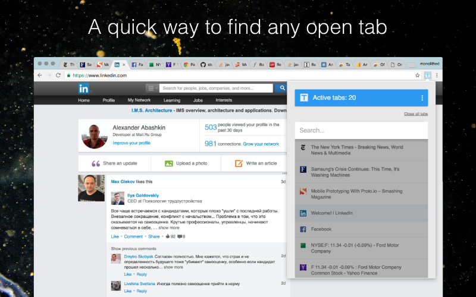

# [Tab Gear](https://chrome.google.com/webstore/detail/tab-gear/almpknjjcngnpimhjmcfgiafmfcdjfae?hl=en-US)

> Tag Gears is an extension for Google Chrome that provides an intuitive tab management.

### Features

Some of the features that will come handy:

* List of all open tabs.
* See incognito tabs.
* Move your tabs in a preferred order — just drag and drop them!
* Search by title and URL — just start typing.
* Tab discarding. Allows Chrome to automatically discard tabs that aren't of great interest to you when it's detected that system memory is running pretty low.
* Displays the number of tabs you currently have open in all your Chrome windows.
* Closing selective tabs.
* Closing all open tabs.
* Quick opening your extensions.
* Localization for English and Russian languages.
* Press Ctrl+Shift+T or ⌘+⇧+T keys to show or hide the browser action popup.
* Do you want to prevent closing multiple tabs? It's possible by default and configurable!


### Preview




### Installation

```
npm install
```

### Development

```
npm start
```

### Build

```
npm run build
```

### Testing

```
npm test
```

### Publication

* Upload extension using [Developer Dashboard](https://chrome.google.com/webstore/developer)


### Updating

* `npm run build`
* Open [Extensions](chrome://extensions/)
* Click "Pack extension"
* Use `cache/build/` to fill "Extension root directory" and "Private key file"
* Move `cache/build/build.crx` to `build/<version>.crx`
* Actualize "update.xml"


### Contributors

1. Bump a version of the package
	* manifest.json
	* package.json

2. Add the release notes
	* CHANGELOG.md


### Todo

- [ ] Bookmarks
- [ ] Pins
- [ ] Reopen closed tabs
- [ ] Sharing
- [ ] Context menu
- [ ] Top menu
- [ ] Replace `localStorage` with `chrome.storage`


### Links

* [Manifest File](https://developer.chrome.com/extensions/manifest)
* [Developer Dashboard](https://chrome.google.com/webstore/developer)
* [Chrome Web Store](https://chrome.google.com/webstore/category/extensions)
* [Supplying Images](https://developer.chrome.com/webstore/images)
